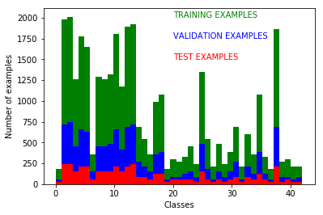
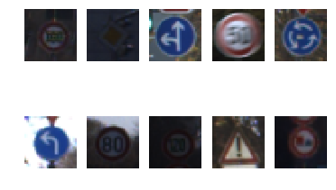
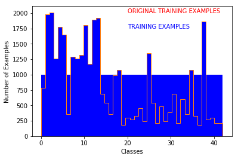
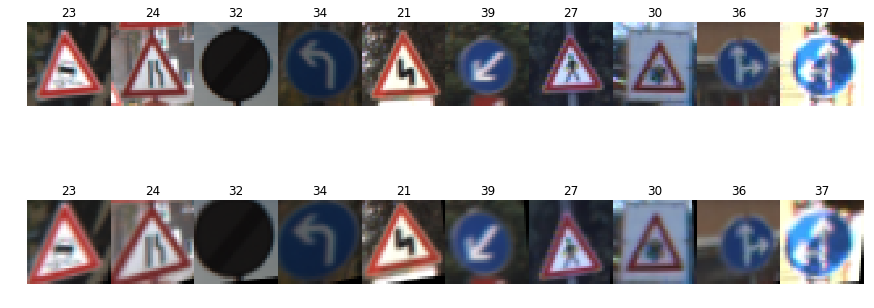
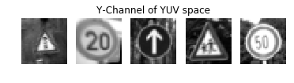
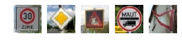
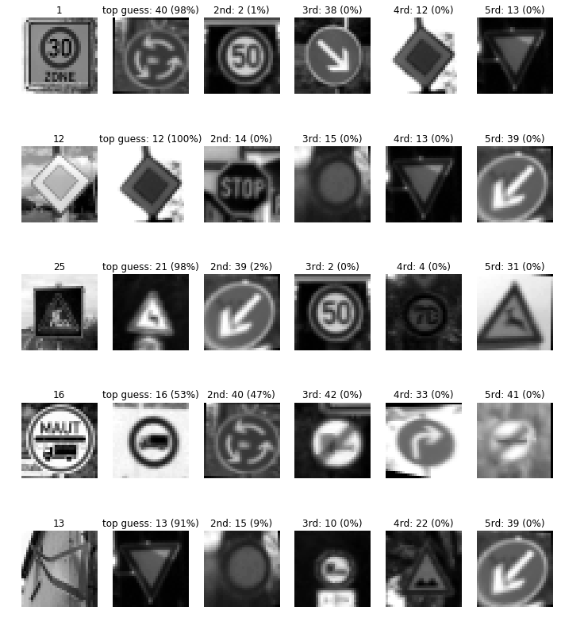

# Traffic Sign Recognition

## Udacity Self-Driving-Car-Engineer Nanodegree 2017, April

### by Christoph Reiners

Build a Traffic Sign Recognition Project

The goals / steps of this project are the following:

    Load the data set (see below for links to the project data set)
    Explore, summarize and visualize the data set
    Design, train and test a model architecture
    Use the model to make predictions on new images
    Analyze the softmax probabilities of the new images
    Summarize the results with a written report

* * *

## Introduction

The goal is to design a neural network that can recognize traffic signs. Therefore the input of the network are images and the output is a classification of the input based on characteristics. Neural networks learn these characteristics on their own in the training. The training will feed known and classified data to the inputs and evaluate the classification made by the network based on the known classification. The evaluation is used by the network to adapt its' recognition of the characteristics to match the desired classification.

### Data Set Summary & Exploration

The data set used is based on the [German Traffic Sign Dataset](http://benchmark.ini.rub.de/?section=gtsrb&subsection=dataset) that holds around 50000 unique images of german traffic signs with a varying resolution between 15x15 to 250x250 pixels. The [actually data set](https://d17h27t6h515a5.cloudfront.net/topher/2017/February/5898cd6f_traffic-signs-data/traffic-signs-data.zip) that is used was provided by Udacity and is already splitted into a large set for training and smaller sets for testing and validation as seen in fig[1]. The data set has:

    Number of training examples   = 34799
    Number of validation examples =  4410
    Number of testing examples    = 12630
    Number of classes = 43

Furthermore the images are rescaled to 32x32 pixels in 3-channel RGB and are annotated so that each image has a corresponding label that serves as classification. Fig2 shows some example images from the training set.

* * *

## Design and Test a Model Architecture

### Augmentation to obtain more data

After the first training attempts of my network granted unsatisfying accuracies I found out, that a more even distributed training set may be better, as a development of a bias towards overrepresented classes will be more unlikely. Yet it did not improved the accuracy right away.

To obtain more data without using another data set, the existing images can be augmented. The existing data is augmented in a way that it can be considered as new data and not only copies of itself. Possible are rotations and mirroring of images, to obtain more data. These are limited to symbols and signs that are somehow symmetric or will form an image of another class. This is quite some wokr to code, so I ignored it. Another way is to transform the images into another perspective/angle. This was quite easily done via the openCV libary. The following code block shows the augment function for a left transfomation. Four corners need to be defined for the input image and these corners will then be fitted into the defined corners of the output image. The ranges where the corners can be were obtained by trying out some values.

In [ ]:

<pre>def augment_perspective_left(image):
    rows, columns   = image.shape[:2]
    in_tl=[0-np.random.randint(-2,3)       , 0-np.random.randint(-1,5)]     #top left corner
    in_tr=[columns-1-np.random.randint(1,7), 0-np.random.randint(1,7)]      #top right corner
    in_br=[columns-1-np.random.randint(1,7), rows-1-np.random.randint(1,7)] #bottom right corner
    in_bl=[0-np.random.randint(-2,3)       , rows-1+np.random.randint(-1,5)]#bottom left corner

    out_tl=[0       , 0]    #top left corner
    out_tr=[columns-1, 0]     #top right corner
    out_br=[columns-1, rows-1]#bottom right corner
    out_bl=[0        , rows-1]#bottom left corner

    in_corners =np.float32([in_tl,in_bl,in_tr,in_br]) 
    out_corners=np.float32([out_tl,out_bl,out_tr,out_br])

    perspective=cv2.getPerspectiveTransform(in_corners,out_corners)
    image=cv2.warpPerspective(image,perspective,(columns,rows))
    return image
</pre>

Each class will be filled up to a number of around 1000 by transforming the image to a right and left perspective of random intensity and result (fig3). The newly gained images are also signed with a label that defines their class as trafficsign. Fig4 shows an original image and its' corresponding augmented copy.  

### Grayscale

As traffic signs are designed to be recognizeable also for colourblind people, only the visualized symbols and the geometric form of the sign matter. Therefore the colour is not a necessary property to classify a traffic sign and the grayscale of the image can be used. This will reduce the complexity of imagefeatures the network will try to classify and may be more accurate in a shorter time/with less training data. According to my mentor a conversion to the YUV colourspace was done and then to grayscale the images only the Y-channel was used (fig5). Compared to the cv2.BGR2GRAYSCALE function there was no change in accuracy observeable.

### Normalization

As most of the outputs and values within a neural network are around +/- 1, the inputs shall be in this range too. Therefore the image-data needed to be normalized. As a pixel can have a intensity of 0 to 255 per colourchannel, a normalization can be done via [ (pixel/122,5)-1 ]. This is also good, as the resulting datatype is float as the datatypes within te neural network are.

* * *

### Final Neural Network Architecture

The final architecture is a slightly changed LeNet as presented in the Udacity lab leading up to this project. All initializers feature the xavier_intializer according to [Convolutional Networks for Traffic Sign Classification (Master’s thesis in Communication Engineering, by FEDERICO ZANETTI, 2016)](http://publications.lib.chalmers.se/records/fulltext/245747/245747.pdf)

    "[...] if the weights in a network start too small, then the signal shrinks as it passes through each layer until it is too tiny to be useful. If the weights in a network are too large when training begins, then the signal grows as it passes through each layer until it is too massive to be useful. Xavier initialization keeps the signal in a reasonable range of values through many layers."

<pre>|  Layer                 |  Input  |  Output |  Description                               |
|------------------------|---------|---------|--------------------------------------------|
|0  Imagedata            | 32x32x3 | 32x32x1 | grayscaled and normalized                  |
|1  Convolutional Layer  | 32x32x1 | 32x32x4 | filter 1x1x1x4 , padding='VALID', stride=1 |
|   Relu and Dropout     |         |         |                                            |
|1  Convolutional Layer  | 32x32x4 | 31x31x5 | filter 2x2x4x5 , padding='VALID', stride=1 |
|   Relu and Dropout     |         |         |                                            |
|3  Convolutional Layer  | 31x31x5 | 28x28x6 | filter 4x4x5x6 , padding='VALID', stride=1 |
|   Relu and Pooling     | 28x28x6 | 14x14x6 | ksize=[1, 2, 2, 1], strides=[1, 2, 2, 1]   |
|   and Dropout          |         |         |                                            |
|4  Convolutional Layer  | 14x14x6 | 10x10x16| filter 5x5x6x16 , padding='VALID', stride=1|
|   Relu and Pooling     | 10x10x16|  5x5x16 | ksize=[1, 2, 2, 1], strides=[1, 2, 2, 1]   |
|   and Dropout          |         |         |                                            |
|   and Flatten          | 5x5x16  |   400   |                                            |
|5  Fully Connected Layer|   400   |   120   |                                            |
|   Relu and Dropout     |         |         |                                            |
|6  Fully Connected Layer|   120   |   84    |                                            |
|   Relu and Dropout     |         |         |                                            |
|7  Fully Connected Layer|   84    |   43    |                                            |
</pre>

### Training and optimizing the Network

I have played with the settings to the LeNet architecture provided in the Udacity Lab. Also I have changed the initilializer because of the above linked master thesis. But the initializer had no real impact on the accuracy, maybe it is only significant trying to stretch out within a 99% accuracy, but I didn't manage to get there, not even close. So the settings below were done either with truncated_normal or xavier intitializier. The last few settings featured always xavier, though. As stated before, I also started with the normal dataset, but filled it up with augmented images. This step didn't showed any improvements. But maybe that helped later as I further tuned the network.

LeNet is the original implementation from the lab. LeNet1 is with added dropouts between the layers, as I thought the network may bias itself too strong towards certain features. And I instantly got an accuracy boost. LeNet2 is added with up to two additional layers together with dropouts before LeNet1\. I thought that a filter of a smaller size may extract some features that the other layers may not take in consideration. The accuracy improved further. Whereas a second small filter didn't improve the accuracy right away, but I did change too many paramaters in this step too which may were in the wrong direction.

Settings will be [Epoch,BatchSize,learningrate // keepingprobabilities(first to last layer)]

Approach:

     A1) LeNet, different settings, all with a maximum validation accuracy of 93%, more often 88%-92%
     A2) LeNet1 [120,  60,0.00085 //           0.960,0.930,0.75,0.50] Validation Accuracy = 0.944
     A3) LeNet1 [120,  60,0.00065 //           0.980,0.980,0.80,0.70] Validation Accuracy = 0.948
     A4) LeNet1 [120,  60,0.00065 //           0.980,0.980,0.80,0.70] Validation Accuracy = 0.935 (switched from BGR2GRAY to BGR2YUV)
     A5) LeNet2 [120,  60,0.00065 //      1.00,0.980,0.980,0.80,0.70] Validation Accuracy = 0.955 (1 layer before LeNet1, filter [1x1x1x4])
     A6) LeNet2 [ 70, 200,0.00065 //      1.00,0.980,0.980,0.80,0.70] Validation Accuracy = 0.92
     A7) LeNet2 [ 50,  60,0.00085 //      1.00,0.980,0.980,0.80,0.70] Validation Accuracy = 0.94
     A8) LeNet2 [ 30, 100,0.00075 //      1.00,0.980,0.980,0.80,0.70] Validation Accuracy = 0.93
     A9) LeNet2 [ 70, 100,0.00075 // 0.80,0.90,0.950,0.950,0.70,0.60] Validation Accuracy = 0.858 (2 layers before LeNet1,both [1x1x1x4])
     A10)LeNet2 [100,1000,0.00055 // 0.99,0.99,0.950,0.950,0.70,0.60] Validation Accuracy = 0.88
     A11)LeNet2 [100,1000,0.00055 // 0.99,0.99,0.950,0.950,0.70,0.60] Validation Accuracy = 0.91 (conv00 [1x1x1x4],conv0[2x2x4x5],con1[4x4x5x6])
     A12)LeNet2 [100, 300,0.00055 // 0.99,0.99,0.950,0.950,0.70,0.60] Validation Accuracy = 0.924
     A13)LeNet2 [100, 300,0.00075 // 0.99,0.99,0.950,0.950,0.70,0.60] Validation Accuracy = 0.935
     A14)LeNet2 [100, 300,0.00090 // 0.99,0.99,0.950,0.950,0.70,0.60] Validation Accuracy = 0.945
     A15)LeNet2 [100, 300,0.00100 // 0.99,0.99,0.950,0.950,0.70,0.60] Validation Accuracy = 0.933
     A16)LeNet2 [100,  50,0.00100 // 0.99,0.99,0.950,0.950,0.70,0.60] Validation Accuracy = 0.954
     A17)LeNet2 [ 30,  50,0.00093 // 0.99,0.99,0.990,0.990,0.80,0.70] Validation Accuracy = 0.91
     A18)LeNet2 [ 30,  50,0.00093 // 0.99,0.99,0.990,0.950,0.50,0.50] Validation Accuracy = 0.92
     A19)LeNet2 [100,  50,0.00093 // 1.00,1.00,0.998,0.995,0.85,0.55] Validation Accuracy = 0.965  // Test Accuracy =0.946
     A20)LeNet2 [100,  50,0.00080 // 1.00,1.00,0.998,0.995,0.85,0.55] Validation Accuracy = 0.962  // Test Accuracy =0.944

The final results of around 96.5% Accuracy for the Validationset and 94,6% for the Testset shows that the network is not overfitted, as both sets are quite similiar acurate. But also it is not well fitted as the achieved accuracies are still pretty low.

The approach list shows, that the dropoutlayers helped improving accuracy. The closer the dropouts are located at the input the smaller should be the dropout. Whereas a high dropoutrate helps on the accuracy if it closer to the output. A small batch size helps improving the accuracy, but takes more computing time, so trying other parameters with a greater batchsize helps keeping computing time low but getting some impression of the influence of the other parameters.

### Performance on new Images

As a challenge the trained network should take on new images and should classify them. Fig.6 shows the chosen images that were found in the internet. 

They feature a limit 30 "Zone", a Vorfahrtsstraße, a construction-site (but as a LED-sign), a 3.5t vehicle sign but with another information new to the network added and a pretty damaged yield sign. Except the second picture the signs may be tough to classify correctly for the network. The "Zone" of the first image could be mistaken for a 20, depending on which feature the network will value higher. The LED constructionsite sign is an inverted colour shape and with contours instead of a flat design. The 3.5t vehicle is not centered and a dominant line may irritate the classification. The yield sign is photographed in a strange angle and it is really deformed, resulting in a shadow in a top corner which may be misinterpreted as a symbol within a warning-triangle sign.

The strange thing is, feeding the images in the network result in different classifications each time. Sometimes only one image is right, sometimes even 3\. That is something that I can not explain, as the network should only generate the classification and not reeavaluate things.

But to the results: as said they range from 20% to 80% accuracy. Fig.7 shows a result and the top five softmax probabilities of the new images. 

It is strange to see that the 30 limit sign is not even considered as second choice as the 30 is clear, big and centered. Instead it is something completly different classified. As the detected sign is with a dark background, it is obvious that not the colours or contrasts matter to the network, but the edges.

On the other hand, the 3.5t vehicle sign is detected properly, although with some doubt. And also the damaged yield sign is recognized without trouble. The construction-site is misdetected as doublecurve and the classification is quite sure about it. In earlier verions this sign was detected correctly, but the 3.5t vehicle caused misclassification. On the other hand, as it is a negativ colour and so to say an unknown symbol altogether to the network. But then again, considering that maybe only edges matter and not colourspace, this misclassification is confusing.

That the network is quite sure about its' misclassifications is not nice to see. It would be a nice project in the future to punish high certainties somehow if it is a misclassification

